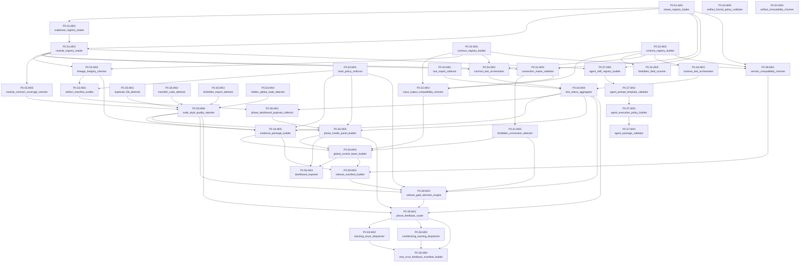

# Module flow RC4.1

```mermaid
flowchart TD
  P0.S1.M01["P0.S1.M01<br/>phase_registry_loader"]
  P0.S1.M02["P0.S1.M02<br/>subphase_registry_loader"]
  P0.S1.M03["P0.S1.M03<br/>module_registry_loader"]
  P0.S1.M04["P0.S1.M04<br/>connection_matrix_validator"]
  P0.S1.M05["P0.S1.M05<br/>forbidden_connection_detector"]
  P0.S2.M01["P0.S2.M01<br/>contract_registry_builder"]
  P0.S2.M02["P0.S2.M02<br/>schema_registry_builder"]
  P0.S2.M03["P0.S2.M03<br/>input_output_compatibility_checker"]
  P0.S2.M04["P0.S2.M04<br/>forbidden_field_scanner"]
  P0.S2.M05["P0.S2.M05<br/>artifact_format_policy_validator"]
  P0.S3.M01["P0.S3.M01<br/>hash_policy_enforcer"]
  P0.S3.M02["P0.S3.M02<br/>lineage_integrity_checker"]
  P0.S3.M03["P0.S3.M03<br/>artifact_manifest_auditor"]
  P0.S3.M04["P0.S3.M04<br/>artifact_immutability_checker"]
  P0.S4.M01["P0.S4.M01<br/>test_report_collector"]
  P0.S4.M02["P0.S4.M02<br/>contract_test_orchestrator"]
  P0.S4.M03["P0.S4.M03<br/>schema_test_orchestrator"]
  P0.S4.M04["P0.S4.M04<br/>test_status_aggregator"]
  P0.S4.M05["P0.S4.M05<br/>evidence_package_builder"]
  P0.S5.M01["P0.S5.M01<br/>duplicate_file_detector"]
  P0.S5.M02["P0.S5.M02<br/>monolith_code_detector"]
  P0.S5.M03["P0.S5.M03<br/>forbidden_import_detector"]
  P0.S5.M04["P0.S5.M04<br/>hidden_global_state_detector"]
  P0.S5.M05["P0.S5.M05<br/>module_contract_coverage_checker"]
  P0.S5.M06["P0.S5.M06<br/>code_style_quality_reporter"]
  P0.S6.M01["P0.S6.M01<br/>phase_dashboard_payload_collector"]
  P0.S6.M02["P0.S6.M02<br/>phase_health_panel_builder"]
  P0.S6.M03["P0.S6.M03<br/>global_control_tower_builder"]
  P0.S6.M04["P0.S6.M04<br/>dashboard_exporter"]
  P0.S7.M01["P0.S7.M01<br/>agent_skill_registry_builder"]
  P0.S7.M02["P0.S7.M02<br/>agent_prompt_template_validator"]
  P0.S7.M03["P0.S7.M03<br/>agent_execution_policy_builder"]
  P0.S7.M04["P0.S7.M04<br/>agent_package_validator"]
  P0.S8.M01["P0.S8.M01<br/>version_compatibility_checker"]
  P0.S8.M02["P0.S8.M02<br/>release_manifest_builder"]
  P0.S8.M03["P0.S8.M03<br/>release_gate_decision_engine"]
  P0.S9.M01["P0.S9.M01<br/>phase_feedback_router"]
  P0.S9.M02["P0.S9.M02<br/>blocking_issue_dispatcher"]
  P0.S9.M03["P0.S9.M03<br/>nonblocking_warning_dispatcher"]
  P0.S9.M04["P0.S9.M04<br/>zero_trust_feedback_manifest_builder"]
  P0.S1.M01 --> P0.S1.M02
  P0.S1.M01 --> P0.S1.M03
  P0.S1.M01 --> P0.S1.M04
  P0.S1.M01 --> P0.S7.M01
  P0.S1.M01 --> P0.S8.M01
  P0.S1.M02 --> P0.S1.M03
  P0.S1.M03 --> P0.S1.M04
  P0.S1.M03 --> P0.S3.M02
  P0.S1.M03 --> P0.S4.M02
  P0.S1.M03 --> P0.S5.M05
  P0.S1.M03 --> P0.S7.M01
  P0.S1.M04 --> P0.S1.M05
  P0.S1.M04 --> P0.S2.M03
  P0.S1.M05 --> P0.S6.M03
  P0.S1.M05 --> P0.S8.M03
  P0.S2.M01 --> P0.S2.M03
  P0.S2.M01 --> P0.S3.M02
  P0.S2.M01 --> P0.S4.M02
  P0.S2.M01 --> P0.S8.M01
  P0.S2.M02 --> P0.S2.M03
  P0.S2.M02 --> P0.S2.M04
  P0.S2.M02 --> P0.S4.M02
  P0.S2.M02 --> P0.S4.M03
  P0.S2.M02 --> P0.S8.M01
  P0.S2.M03 --> P0.S6.M03
  P0.S3.M01 --> P0.S3.M03
  P0.S3.M01 --> P0.S4.M05
  P0.S3.M01 --> P0.S6.M02
  P0.S3.M01 --> P0.S8.M03
  P0.S3.M02 --> P0.S3.M03
  P0.S3.M02 --> P0.S4.M05
  P0.S3.M03 --> P0.S6.M01
  P0.S4.M01 --> P0.S4.M04
  P0.S4.M02 --> P0.S4.M04
  P0.S4.M03 --> P0.S4.M04
  P0.S4.M04 --> P0.S4.M05
  P0.S4.M04 --> P0.S6.M01
  P0.S4.M04 --> P0.S6.M02
  P0.S4.M04 --> P0.S8.M03
  P0.S4.M04 --> P0.S9.M01
  P0.S4.M05 --> P0.S6.M03
  P0.S4.M05 --> P0.S8.M02
  P0.S5.M01 --> P0.S5.M06
  P0.S5.M02 --> P0.S5.M06
  P0.S5.M03 --> P0.S5.M06
  P0.S5.M04 --> P0.S5.M06
  P0.S5.M05 --> P0.S5.M06
  P0.S5.M06 --> P0.S4.M05
  P0.S5.M06 --> P0.S6.M02
  P0.S5.M06 --> P0.S8.M03
  P0.S5.M06 --> P0.S9.M01
  P0.S6.M01 --> P0.S6.M02
  P0.S6.M02 --> P0.S6.M03
  P0.S6.M02 --> P0.S6.M04
  P0.S6.M02 --> P0.S9.M01
  P0.S6.M03 --> P0.S6.M04
  P0.S6.M03 --> P0.S8.M02
  P0.S7.M01 --> P0.S7.M02
  P0.S7.M02 --> P0.S7.M03
  P0.S7.M03 --> P0.S7.M04
  P0.S8.M01 --> P0.S8.M02
  P0.S8.M02 --> P0.S8.M03
  P0.S8.M03 --> P0.S9.M01
  P0.S9.M01 --> P0.S9.M02
  P0.S9.M01 --> P0.S9.M03
  P0.S9.M01 --> P0.S9.M04
  P0.S9.M02 --> P0.S9.M04
  P0.S9.M03 --> P0.S9.M04
```
