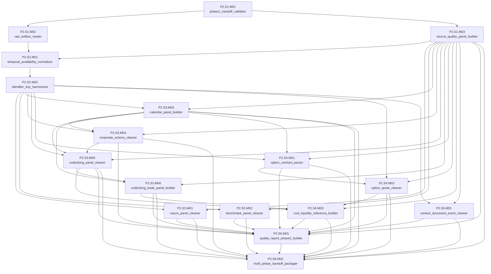

# Module flow RC4.1

```mermaid
flowchart TD
  P2.S1.M01["P2.S1.M01<br/>phase1_handoff_validator"]
  P2.S1.M02["P2.S1.M02<br/>raw_artifact_reader"]
  P2.S1.M03["P2.S1.M03<br/>source_quality_panel_builder"]
  P2.S2.M01["P2.S2.M01<br/>temporal_availability_normalizer"]
  P2.S2.M02["P2.S2.M02<br/>identifier_key_harmonizer"]
  P2.S3.M01["P2.S3.M01<br/>macro_panel_cleaner"]
  P2.S3.M02["P2.S3.M02<br/>benchmark_panel_cleaner"]
  P2.S3.M03["P2.S3.M03<br/>calendar_panel_builder"]
  P2.S3.M04["P2.S3.M04<br/>corporate_actions_cleaner"]
  P2.S3.M05["P2.S3.M05<br/>underlying_panel_cleaner"]
  P2.S3.M06["P2.S3.M06<br/>underlying_trade_panel_builder"]
  P2.S4.M01["P2.S4.M01<br/>option_contract_parser"]
  P2.S4.M02["P2.S4.M02<br/>option_quote_cleaner"]
  P2.S4.M03["P2.S4.M03<br/>cost_liquidity_reference_builder"]
  P2.S5.M01["P2.S5.M01<br/>context_document_event_cleaner"]
  P2.S6.M01["P2.S6.M01<br/>quality_report_phase2_builder"]
  P2.S6.M02["P2.S6.M02<br/>multi_phase_handoff_packager"]
  P2.S1.M01 --> P2.S1.M02
  P2.S1.M01 --> P2.S1.M03
  P2.S1.M02 --> P2.S2.M01
  P2.S1.M03 --> P2.S2.M01
  P2.S1.M03 --> P2.S3.M01
  P2.S1.M03 --> P2.S3.M02
  P2.S1.M03 --> P2.S3.M03
  P2.S1.M03 --> P2.S3.M04
  P2.S1.M03 --> P2.S3.M05
  P2.S1.M03 --> P2.S3.M06
  P2.S1.M03 --> P2.S4.M01
  P2.S1.M03 --> P2.S4.M02
  P2.S1.M03 --> P2.S4.M03
  P2.S1.M03 --> P2.S5.M01
  P2.S1.M03 --> P2.S6.M01
  P2.S1.M03 --> P2.S6.M02
  P2.S2.M01 --> P2.S2.M02
  P2.S2.M02 --> P2.S3.M01
  P2.S2.M02 --> P2.S3.M02
  P2.S2.M02 --> P2.S3.M03
  P2.S2.M02 --> P2.S3.M04
  P2.S2.M02 --> P2.S3.M05
  P2.S2.M02 --> P2.S4.M01
  P2.S2.M02 --> P2.S4.M02
  P2.S2.M02 --> P2.S5.M01
  P2.S3.M01 --> P2.S6.M01
  P2.S3.M01 --> P2.S6.M02
  P2.S3.M02 --> P2.S6.M01
  P2.S3.M02 --> P2.S6.M02
  P2.S3.M03 --> P2.S3.M04
  P2.S3.M03 --> P2.S3.M05
  P2.S3.M03 --> P2.S3.M06
  P2.S3.M03 --> P2.S4.M01
  P2.S3.M03 --> P2.S6.M01
  P2.S3.M03 --> P2.S6.M02
  P2.S3.M04 --> P2.S3.M05
  P2.S3.M04 --> P2.S6.M01
  P2.S3.M04 --> P2.S6.M02
  P2.S3.M05 --> P2.S3.M06
  P2.S3.M05 --> P2.S4.M03
  P2.S3.M05 --> P2.S6.M01
  P2.S3.M05 --> P2.S6.M02
  P2.S3.M06 --> P2.S4.M03
  P2.S3.M06 --> P2.S6.M01
  P2.S3.M06 --> P2.S6.M02
  P2.S4.M01 --> P2.S4.M02
  P2.S4.M01 --> P2.S6.M01
  P2.S4.M01 --> P2.S6.M02
  P2.S4.M02 --> P2.S4.M03
  P2.S4.M02 --> P2.S6.M01
  P2.S4.M02 --> P2.S6.M02
  P2.S4.M03 --> P2.S6.M01
  P2.S4.M03 --> P2.S6.M02
  P2.S5.M01 --> P2.S6.M01
  P2.S5.M01 --> P2.S6.M02
  P2.S6.M01 --> P2.S6.M02
```
